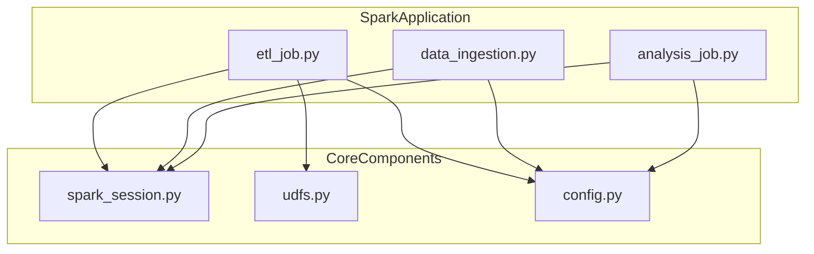

```mermaid
graph TD
    subgraph SparkApplication
        direction LR
        etl_job["etl_job.py"]
        data_ingestion["data_ingestion.py"]
        analysis_job["analysis_job.py"]
    end

    subgraph CoreComponents
        direction LR
        spark_session["spark_session.py"]
        udfs["udfs.py"]
        config["config.py"]
    end

    etl_job --> spark_session
    etl_job --> udfs
    etl_job --> config

    data_ingestion --> config
    data_ingestion --> spark_session

    analysis_job --> config
    analysis_job --> spark_session
```
