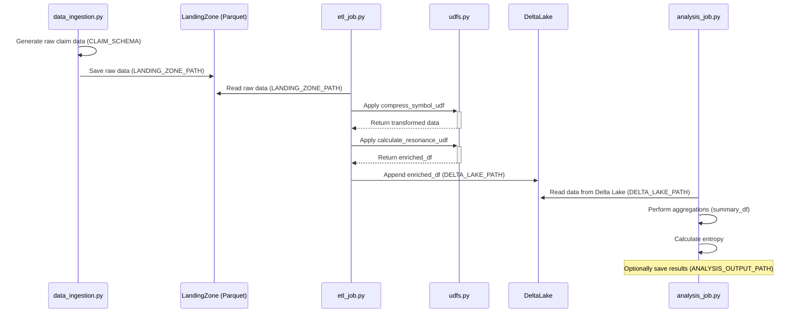

```mermaid
sequenceDiagram
    participant DI as data_ingestion.py
    participant LZ as LandingZone (Parquet)
    participant ETL as etl_job.py
    participant UDFs as udfs.py
    participant DL as DeltaLake
    participant AJ as analysis_job.py

    DI->>+DI: Generate raw claim data (CLAIM_SCHEMA)
    DI->>LZ: Save raw data (LANDING_ZONE_PATH)
    ETL->>+LZ: Read raw data (LANDING_ZONE_PATH)
    ETL->>+UDFs: Apply compress_symbol_udf
    UDFs-->>-ETL: Return transformed data
    ETL->>+UDFs: Apply calculate_resonance_udf
    UDFs-->>-ETL: Return enriched_df
    ETL->>DL: Append enriched_df (DELTA_LAKE_PATH)
    AJ->>+DL: Read data from Delta Lake (DELTA_LAKE_PATH)
    AJ->>AJ: Perform aggregations (summary_df)
    AJ->>AJ: Calculate entropy
    Note over AJ: Optionally save results (ANALYSIS_OUTPUT_PATH)
```
